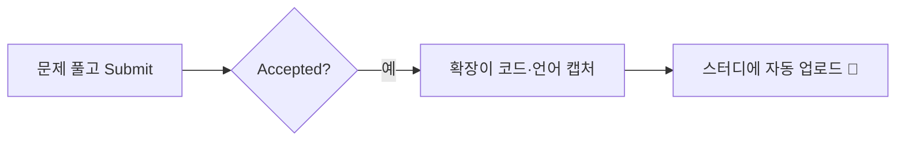
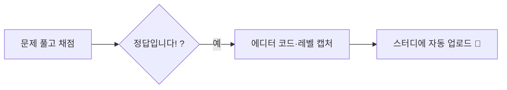

<div align="center">

# 🌱 7일 7솔 — 알고리즘 스터디

**풀면 잔디, 못 풀면 벌금.** 그 사이 모든 건 자동입니다.

LeetCode·프로그래머스에서 문제를 정답 처리하면 크롬 확장이 코드를 감지해 스터디에 자동 업로드해요.
목표(예: **N일에 M개**)를 못 채우면 벌금이 장부에 기록되고, 실제 정산은 방장 계좌로 오프라인 진행합니다.

[](./docs/사용법.pdf)
[](https://htmlpreview.github.io/?https://github.com/jyt6640/algo-study/blob/master/docs/guide.html)
[](https://github.com/jyt6640/algo-study/releases/latest/download/algo-study-extension.zip)
[](https://algo-study-eight.vercel.app)

</div>

---

## 📖 사용법 (3분 요약)

| | 단계 | 하는 일 |
|:--:|---|---|
| 1️⃣ | **깃허브 로그인** | 가입 없이 GitHub 계정으로 바로 시작 |
| 2️⃣ | **스터디 참여·개설** | 초대 코드로 참여하거나 방을 새로 만들어 규칙 설정 |
| 3️⃣ | **확장 설치** | 크롬 웹스토어(자동 업데이트) 또는 릴리스에서 개발자 모드 |
| 4️⃣ | **연동 + 토큰** | LeetCode/프로그래머스 아이디 연동, 확장에 **연동 토큰** 붙여넣기 |
| 5️⃣ | **그냥 문제 풀기** | 정답 뜨면 코드가 알아서 스터디에 올라감 |

> 📄 **전체 그림 가이드** → [사용법 PDF](./docs/사용법.pdf) · [인터랙티브 HTML](https://htmlpreview.github.io/?https://github.com/jyt6640/algo-study/blob/master/docs/guide.html)

### 문제를 풀면 → 코드가 알아서 올라간다

**LeetCode** (leetcode.com 로그인 상태 · 확장 설치됨)



**프로그래머스** (school.programmers.co.kr 로그인 상태 · 확장 설치됨)



- **예전에 푼 것도 한 번에**: 확장 팝업의 *LeetCode 최근 풀이 코드 가져오기*(최근 20개) / *프로그래머스 푼 문제 전체 가져오기*.
- **코드까지** 올리려면 확장이 필요. 문제 수·잔디·정답 여부만 보는 건 연동만으로도 동작.

---

## ⬇ 확장 설치

### A · 크롬 웹스토어 (가장 쉬움, 자동 업데이트) ⭐
[Chrome Web Store 설치](https://chromewebstore.google.com/detail/khkdmmojedhfebdolbfkdgkldeiabafe) — 설치하면 크롬이 새 버전을 **자동 갱신**한다. `ext-v*` 태그를 밀면 CI/CD가 스토어에 게시.

### B · 개발자 모드 (릴리스에서, 심사 대기 없이 최신)

1. [최신 확장 zip 내려받기](https://github.com/jyt6640/algo-study/releases/latest/download/algo-study-extension.zip) → **압축 해제** (또는 [릴리스 페이지](https://github.com/jyt6640/algo-study/releases/latest)에서 `algo-study-extension.zip`)
2. 주소창에 `chrome://extensions` → 우측 상단 **개발자 모드 ON**
3. **압축해제된 확장 프로그램을 로드** → `manifest.json`이 있는 폴더 선택
4. 웹 `내 프로필 → 확장 연동 토큰 관리 → 새 토큰 발급` → 복사 → 확장 팝업에 붙여넣고 **저장**

> 최신 확장은 **연동 토큰만** 입력하면 된다(‘API 주소’ 칸 제거, v0.6.3). 확장을 업데이트했다면 열려 있던 LeetCode·프로그래머스 **탭을 새로고침**할 것.
> 개발자 모드는 자동 갱신이 안 되므로 새 버전은 zip을 다시 받아 `chrome://extensions`에서 ↻ 새로고침.

---

## 🧱 스택

- **Next.js 15 (App Router) + TypeScript + Tailwind v4**
- **Drizzle ORM + Neon(Postgres)** — 서버리스 HTTP 드라이버
- **Vercel Cron** — 수집 + 마감 배치
- **Chrome 확장 (MV3)** — LeetCode·프로그래머스 Accepted 코드 자동 캡처 (`/extension`)

### 풀이 수집 경로 (상호보완)

1. **서버 폴링** (`/api/cron/collect`) — LeetCode 비공식 GraphQL `recentAcSubmissionList`. 확장 미설치자도 커버.
2. **확장 push** (`/api/ingest`, `/api/ingest/bulk`) — 유저 브라우저에서 코드까지 캡처. 비공개 프로필·프로그래머스도 동작.

두 경로 모두 `(platform, problem_slug)` 기준으로 dedup 되어 기간 카운트에 합산된다.

---

## 🚀 로컬 실행

```bash
cp .env.example .env      # DATABASE_URL(Neon), CRON_SECRET 채우기
npm install
npm run db:push           # 스키마를 DB에 반영
npm run dev               # http://localhost:3000
```

- Neon 무료 계정: https://neon.tech 에서 프로젝트 생성 → connection string 복사.

## 🔌 주요 엔드포인트

| 메서드 | 경로 | 설명 |
|--------|------|------|
| POST | `/api/groups` | 그룹 생성 (+ 방장 유저) |
| POST | `/api/groups/join` | 초대코드로 가입 |
| POST | `/api/tokens` | 확장 연동 토큰 발급 |
| POST | `/api/ingest` | 확장 push 수신 (`Authorization: Bearer <토큰>`) |
| POST | `/api/ingest/bulk` | 과거 풀이 일괄 업로드(코드 포함) |
| POST | `/api/link` | 플랫폼 핸들 연동 (`Bearer` + `{handle}`) |
| GET | `/api/cron/collect` | 폴링 수집 배치 (Cron) |
| GET | `/api/cron/finalize` | 마감·벌금 확정 배치 (Cron) |
| — | `/groups/[id]` | 그룹 대시보드 (진행률·예상 벌금·벌금 장부) |
| — | `/groups/[id]/solve/[solveId]` | 특정 풀이의 정답 코드 열람 |

Cron 엔드포인트는 프로덕션에서 `Authorization: Bearer $CRON_SECRET` 필요.

## ☁️ 배포 (Vercel)

1. GitHub 레포 연결 → Vercel import
2. 환경변수 `DATABASE_URL`, `CRON_SECRET` 설정
3. `vercel.json` 의 crons 자동 등록. **Hobby 플랜은 크론이 하루 1회 제한**이라 배치는 매일 1회로 설정됨. 실시간성은 확장 push 가 보완.

## ⚠️ 알려진 한계

- LeetCode GraphQL 은 **비공식** — 언제든 차단 가능. 확장 push 로 이중화.
- 프로그래머스는 공개 API가 없어 채점 결과를 **DOM으로 감지**(“정답입니다!” 모달) — UI 변경에 취약.
- 확장 자동 업데이트는 **웹스토어 설치** 기준. 개발자 모드는 수동 갱신.

---

> 기획 전문은 [PRD.md](./PRD.md), 디자인 원칙은 [DESIGN.md](./DESIGN.md) 참고.
